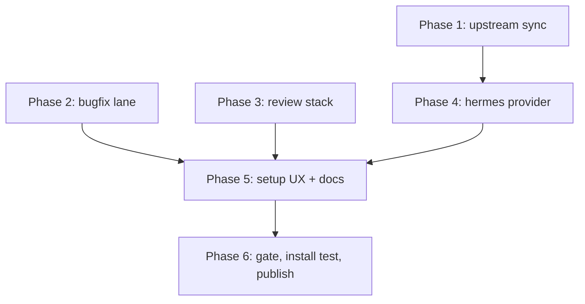

# Harness upgrades: review stack, bugfix lane, Hermes provider, setup UX, upstream sync

| | |
|---|---|
| **Status** | done <!-- draft → approved → in-progress → done --> |
| **Created** | 2026-08-03 |
| **Modified** | 2026-08-03 |
| **Spec** | none — maintenance work on the toolbelt itself; no product behavior contract changes |
| **Branch** | plan/harness-upgrades |
| **Related plans** | none |
| **Review verdict** | [APPROVE](../reviews/2026-08-03-harness-upgrades.md) |
| **Audit outcome** | not run |

## Summary

Five upgrades to the agentic-engineering toolbelt, built in the private repo first, then
published to public main via the existing snapshot flow: (1) chain review-plan + code-audit
on by default, (2) add a bugfix lightweight lane, (3) add native Hermes provider support,
(4) make the setup launcher intuitive and documented, (5) track drift from Matt Pocock's
upstream skills repo so adaptations stay visible when he updates.

## Problem

- Review is the user's chosen quality gate, but code-audit (correctness) is optional in
  the workflow registry; only review-plan (conformance) is required.
- Small fixes currently must run the full spec → plan-grilling → execute → review chain.
- Hermes is not a supported provider; the user works with Hermes natively.
- `agentic` launcher exists but setup is a bare install command with no wizard; doctor
  reports gaps without remedies.
- 8 skills are adapted from Matt Pocock's repo (last upstream commit 2026-07-28); nothing
  tracks upstream changes, so porting improvements is a manual, forgettable chore.

## Solution

**Phase 1 — upstream sync registry + drift check.**
- New `upstream.json` registry (repo root): one entry per derived skill — local skill,
  upstream repo/path, last-synced commit SHA, last-synced date, adaptation notes.
- New `scripts/maintenance/check_upstream.py` (`agentic check-upstream`): reads registry,
  fetches each pinned upstream file via GitHub API, compares against the pinned SHA,
  prints per-skill drift status (CURRENT / CHANGED / UNREACHABLE). Exit 0 when all
  current, 1 when any changed (so a weekly cron can act on it). No auto-merge —
  adaptations are manual ports; the tool makes drift visible, a human/agent reviews.
- Registry seeded for the 8 attributed skills (ATTRIBUTION.md table kept in sync):
  tdd→engineering/tdd, spec→engineering/to-spec, build-skill→productivity/writing-great-skills,
  plan→engineering/tdd (testing-strategy doctrine), commit→engineering/setup-pre-commit
  (verify path exists; if gone, record "upstream removed" and flag), wayfinder→engineering/wayfinder,
  research→engineering/research, diagnosing-bugs→engineering/diagnosing-bugs.
- Selftest for the script; wire into check_all.py selftests list.

**Phase 2 — bugfix lightweight lane.**
- New skill `skills/bugfix/` (explicit-trigger, like the others): triage rules (1 concern,
  1–3 files, no new deps, no schema/API/behavior-contract change, reproducible root cause;
  else route to full chain), references `diagnosing-bugs` for investigation.
- `assets/bugfix-template.md`: compact plan (~40 lines) — symptom+repro, proven root
  cause, surgical fix, regression test (red first), validation, risk/rollback, DoD.
  Keeps exactly one `### Phase 1 — Fix` with `TDD: strict` so the existing executor and
  resume-integrity checks work unchanged.
- Review stays mandatory: bugfix plans go through review-plan like any other.
- Register in toolbelt.json skillPolicy (explicit) + skillMaturity (design-verified),
  add tests.md + agents/openai.yaml, update docs/app-build-workflow.html map.

**Phase 3 — review stack on by default.**
- toolbelt.json workflow: `verify` skills become ["review-plan", "code-audit"];
  `audit` keeps ["security-audit"] (risk-gated — stays optional; default depth low).
- `code-audit` unchanged as a skill; the chaining is registry + docs so the default
  pipeline runs conformance + correctness before ship.
- Update docs/app-build-workflow.html and docs/capabilities.md to show the stack.

**Phase 4 — Hermes provider.**
- toolbelt.py: add "hermes" to PROVIDERS; install group copies each skill's SKILL.md +
  references/ + assets/ + scripts/ into `~/.hermes/skills/agentic-engineering/<name>/`,
  and agents/executor.md into execute's dir as references/executor.md.
- Collision policy: exclude plan, tdd, dogfood (Hermes bundled names); ship one router
  skill `agentic-engineering` (installed under ~/.hermes/skills/) documenting the
  workflow and pointing at the canonical repo copies for the three exclusions.
- detect_installed_providers + install-state cover hermes; gate drift check extended.
- toolbelt.json providers section + README provider table get hermes rows.

**Phase 5 — setup UX + docs.**
- `agentic setup` interactive wizard: doctor → explain findings → install selected
  providers (default all detected CLIs, hermes included) → re-run doctor → next-steps
  banner. New `setup` command in toolbelt.py; dry-run safe.
- doctor gains `--hints`: each missing capability gets one-line consequence + remedy
  (docker → sandbox unavailable + install hint; cmux → macOS-only; launcher → run install).
- README.md: new "Setup" section (install, setup wizard, doctor, verify, update),
  provider table with hermes row, lightweight-lane mention.
- New docs/setup.md: detailed setup/install/update/uninstall paper, troubleshooting,
  provider matrix, platform notes.

## Success criteria

- [ ] `agentic check-upstream` runs from a clean checkout; reports CURRENT for all 8
      pinned skills (or CHANGED/UNREACHABLE with a clear reason) and exits 0.
- [ ] `agentic check-upstream` exits 1 when a registry entry's pinned SHA is stale
      (selftest pins this).
- [ ] bugfix skill passes skill lint; its compact template has exactly one Phase 1
      section parseable by the executor contract; bugfix registered in toolbelt.json.
- [ ] toolbelt.json verify stage lists review-plan + code-audit.
- [ ] `agentic install --providers hermes` (dry-run) shows hermes artifacts under
      ~/.hermes/skills/agentic-engineering/ minus the 3 excluded names, and
      detect_installed_providers reports hermes after install.
- [ ] `agentic setup` runs end-to-end in a temp HERMES_HOME/agent home (selftest).
- [ ] `agentic doctor --hints` prints a remedy line for at least docker + launcher.
- [ ] README Setup section and docs/setup.md exist and match actual behavior.
- [ ] Full gate green: `python3 scripts/ci/check_all.py` → CI_VERDICT: PASS.
- [ ] Public repo published from private via existing snapshot flow (just publish).

## Non-goals / out of scope

- No auto-merging of upstream skills — adaptations are manual; drift detection only.
- No removal of claude/codex/pi providers.
- No changes to executor/reviewer agent behavior beyond what phases above require.
- No new external dependencies (stdlib + GitHub API only).

## Assumptions & open questions

- **Assumption:** hermes home resolves to ~/.hermes on this box (no HERMES_HOME env);
  installer probes $HERMES_HOME first, falls back to ~/.hermes.
- **Assumption:** upstream commit/setup-pre-commit path exists; if the API 404s, the
  registry records "upstream removed" and the skill is flagged for review, not dropped.
- **Open question:** none blocking.

## Research findings

| Finding | Provenance | Source | Plan impact |
|---|---|---|---|
| Hermes skill format = SKILL.md + YAML name/description frontmatter, matching canonical skills | [VERIFIED: local install] | ~/.hermes/hermes-agent/default_soul.py, skills index | Hermes provider is a copy job, not a render |
| Hermes bundled skills include plan, tdd, dogfood (name collisions) | [VERIFIED: local install] | ~/.hermes/skills/ index | Exclude 3 names; router skill covers them |
| Matt Pocock upstream last commit 2026-07-28; active | [VERIFIED: GitHub API] | api.github.com/repos/mattpocock/skills | Registry + drift check justified |
| All 8 attributed skills map to live upstream paths | [VERIFIED: GitHub API] | api.github.com contents listings | Registry seedable today |

## Dependencies

none — stdlib (urllib) + existing scripts conventions only.

## Relevant files

**Existing (to change):** scripts/toolbelt.py, scripts/ci/check_all.py, toolbelt.json,
README.md, docs/app-build-workflow.html, docs/capabilities.md, ATTRIBUTION.md,
skills/plan/SKILL.md (one-line reference to bugfix lane, if needed).

**New (to create):** upstream.json, scripts/maintenance/check_upstream.py,
skills/bugfix/SKILL.md, skills/bugfix/assets/bugfix-template.md, skills/bugfix/tests.md,
skills/bugfix/agents/openai.yaml, skills/agentic-engineering/SKILL.md (router),
docs/setup.md.

## Implementation phases

### Phase 1 — Upstream sync registry + drift check

- [x] 1.1 Write upstream.json with the 8 derived skills, pinned to current upstream SHAs (fetch now)
- [x] 1.2 Write scripts/maintenance/check_upstream.py (registry parse, GitHub API fetch via urllib, SHA compare, exit codes, --selftest with a hermetic fixture)
- [x] 1.3 Wire selftest into scripts/ci/check_all.py SELFTESTS
- [x] 1.4 Add `check-upstream` launcher command to toolbelt.py forwarding table
- [x] 1.5 Sync ATTRIBUTION.md table with registry contents

**TDD:** strict
**Validation:** `python3 scripts/maintenance/check_upstream.py` against real upstream; `python3 scripts/ci/check_all.py` (selftest green); `agentic check-upstream` after launcher update.

### Phase 2 — Bugfix lightweight lane

- [x] 2.1 Write skills/bugfix/SKILL.md (triage rules, diagnosing-bugs reference, workflow)
- [x] 2.2 Write skills/bugfix/assets/bugfix-template.md (single-phase, executor-compatible)
- [x] 2.3 Write skills/bugfix/tests.md + skills/bugfix/agents/openai.yaml (repo convention)
- [x] 2.4 Register in toolbelt.json (skillPolicy explicit + skillMaturity design-verified)
- [x] 2.5 Update docs/app-build-workflow.html skill map + README workflow line

**TDD:** none — skill content is prose; validated by the skill/catalog lints.
**Validation:** `python3 scripts/ci/check_all.py` (skill lint, catalog lint); dry-run the template through a real tiny fix in a scratch repo if time permits.

### Phase 3 — Review stack on by default

- [x] 3.1 toolbelt.json: verify skills → ["review-plan", "code-audit"]
- [x] 3.2 Update docs/app-build-workflow.html + docs/capabilities.md workflow sections

**TDD:** none — registry + docs change; lint_records/skill_catalog validate the JSON shape.
**Validation:** `python3 scripts/ci/check_all.py`; `agentic check` passes with the new registry.

### Phase 4 — Hermes provider

- [x] 4.1 toolbelt.py: add hermes to PROVIDERS; desired_artifacts group (copy SKILL.md + references/assets/scripts; exclude plan/tdd/dogfood; copy executor.md as execute's references/executor.md)
- [x] 4.2 detect_installed_providers + install + uninstall + state handling for hermes
- [x] 4.3 Write skills/agentic-engineering/SKILL.md router (workflow map + repo pointers for the 3 exclusions)
- [x] 4.4 Extend generated-provider drift check in check_all.py (providers/hermes artifacts current)
- [x] 4.5 toolbelt.json providers: hermes manifest; README provider table row
- [x] 4.6 Selftest: install --dry-run --providers hermes in temp home; assert artifact set

**TDD:** strict
**Validation:** dry-run install to temp home; real `python3 scripts/toolbelt.py install --providers hermes` on this box (writes ~/.hermes/skills/agentic-engineering/); `hermes` picks up the router skill; gate green.

### Phase 5 — Setup UX + docs

- [x] 5.1 toolbelt.py: `setup` command (doctor → explain → install → verify → banner), interactive on TTY, non-interactive flags for CI
- [x] 5.2 doctor `--hints`: remedy line per missing capability (docker, cmux, launcher, providers)
- [x] 5.3 README.md Setup section + provider table hermes row + lightweight-lane mention
- [x] 5.4 docs/setup.md detailed paper (install, setup, doctor, update, uninstall, troubleshooting, provider matrix, platform notes)

**TDD:** strict
**Validation:** `agentic setup` end-to-end on this box (installs launcher + hermes provider); `agentic doctor --hints` output review; gate green.

### Phase 6 — Gate, install test, publish

- [x] 6.1 Full gate green (check_all.py + doctor)
- [x] 6.2 Real install on this box (launcher + hermes provider); verify `agentic` on PATH
- [x] 6.3 LESSONS.md line for the self-corrected review-cap fact (per AGENTS.md §X)
- [x] 6.4 DEVLOG.md entry; commit on feature branch; review-plan + code-audit on the branch
- [!] 6.5 Publish to public repo via existing snapshot flow (user-invoked, not a blocker)

**TDD:** none — verification phase.
**Validation:** everything above; `agentic gate`; `git log` clean per-phase commits.

## Test / validation strategy

- Behavioral logic (check_upstream exit codes, hermes artifact set, setup wizard) gets
  hermetic selftests wired into check_all.py — the repo's existing pattern.
- Skill content validated by the existing skill/catalog/sediment lints.
- End-to-end: real install to this box's homes (launcher, hermes), real upstream fetch.

## Risks & rollback

- **Risk:** hermes provider collides with Hermes bundled skill updates (Hermes ships new
  skills over time). **Mitigation:** exclusion list is documented; router skill points at
  repo; re-run install after toolbelt pulls refresh copies.
- **Risk:** upstream API rate limits (unauthenticated 60/hr). **Mitigation:** one fetch
  per skill per run, sequential; UNREACHABLE ≠ CHANGED; cache last-check timestamp.
- **Risk:** setup wizard breaks non-TTY contexts. **Mitigation:** flags for CI; selftest
  covers piped mode.
- **Rollback:** all changes live in private repo behind the snapshot flow; revert = git
  revert + re-publish; installer is idempotent and hash-tracked.

## Decisions & tradeoffs

- **Drift detection over auto-merge** — adaptations diverge deliberately; auto-porting
  upstream text would corrupt local doctrine. Cost: sync stays a manual review step.
- **Copy-based hermes install over symlink** — consistent with claude/codex/pi install
  semantics and hash-tracked updates. Cost: 30 skills × ~6 files duplicated on disk.
- **Exclude 3 colliding names** — Hermes resolves skills by name; shadowing bundled
  plan/tdd/dogfood would corrupt other work. Router skill covers them from the repo.
- **code-audit required, security-audit risk-gated** — matches the user's review-stack
  intent without making every fix carry a full security pass.

## Definition of Done

- [ ] All success criteria met
- [ ] Tests pass (selftests for all new logic wired into the gate)
- [ ] Diff is surgical — every changed line justified by this plan
- [ ] Gate green locally; install verified on this box; public repo published from private

## References

- Matt Pocock skills repo: https://github.com/mattpocock/skills
- Hermes docs (skill format, providers): https://hermes-agent.nousresearch.com/docs
- Repo's own toolbelt.py, check_all.py, ATTRIBUTION.md, README.md (read this session)

## Notes

Working repo is agentic-engineering-private; public repo is the snapshot target. Hermes
is not a native provider today — this plan makes it one without touching claude/codex/pi.

## Execution Notes

Built and verified on 2026-08-03 on branch `plan/harness-upgrades`:

- **Phase 1 (upstream sync):** `upstream.json` pins 12 derived skills (registry covers
  the private repo's full ATTRIBUTION list, not the public snapshot's 8). 
  `scripts/maintenance/check_upstream.py` is selftested (hermetic, in the gate),
  reports CURRENT/CHANGED/UNREACHABLE, exits 0/1/2. Wired as `agentic check-upstream`
  and into a weekly GitHub Action that opens an issue on drift and stays quiet when
  current. Real run against upstream: 12/12 CURRENT.
- **Phase 2 (bugfix lane):** `skills/bugfix/` — triage gate, compact single-phase
  template (canonical shape so the executor and review-plan work unchanged), tests.md,
  registered in toolbelt.json (explicit + design-verified), docs map updated. Reviews
  remain mandatory in the lane.
- **Phase 3 (review stack):** toolbelt.json `verify` = [review-plan, code-audit]
  (mandatory), `audit` = [security-audit] (risk-gated). Workflow HTML updated.
- **Phase 4 (Hermes provider):** toolbelt.py gained the hermes install group (copies
  skills + executor.md reference + router), $HERMES_HOME-aware, with a 4-name
  exclusion set (plan/tdd/dogfood/research — Hermes bundles those names/namespace).
  Router skill at providers/hermes/router.md installs as `~/.hermes/skills/
  agentic-engineering/SKILL.md`. Installed for real on this box; Hermes indexes all
  28 skills; gate drift check extended. copy_managed_dir gained `extra_files` so the
  executor.md injection stays inside the managed snapshot.
- **Phase 5 (setup UX):** `agentic setup` wizard (doctor → explain → confirm →
  install → verify → next steps), doctor `--hints` remedy lines, README Setup
  section, docs/setup.md. Selftested; run end-to-end here (dry-run).
- **Phase 6:** gate green (CI_VERDICT: PASS), launcher + hermes installed and
  verified, LESSONS + DEVLOG updated. Publish to public is the one remaining
  user-invoked step (6.5).
- **Out-of-scope fix required by the gate:** pre-existing flaky eval selftest
  (TOCTOU on /proc/<pid>/stat in run_eval.py `child_survived`) — see Amendments.

Reviewer should look closely at: the hermes exclusion set (4 names) and the router
skill's repo-path pointers; the extra_files snapshot semantics in copy_managed_dir;
and the upstream-check workflow's issue-dedupe logic.

## Amendments

- 2026-08-03 — Registry covers 12 attributed skills, not 8: the private repo's ATTRIBUTION.md lists domain-modeling, codebase-design, improve-codebase-architecture, and grilling as derived from Matt Pocock's repo, so upstream.json pins all 12 (the public snapshot's 8-entry list was stale).
- 2026-08-03 — Fixed a pre-existing flaky eval selftest that blocked the gate: `child_survived` in scripts/eval/run_eval.py read /proc/<pid>/stat after the child was reaped (TOCTOU), raising FileNotFoundError. Caught and treated as dead. Unrelated to this plan's scope but required for CI_VERDICT: PASS.
- 2026-08-03 — Weekly check ships as a GitHub Action (.github/workflows/upstream-check.yml) instead of a local cron, per user request: opens a drift issue when upstream moves, stays quiet when current.
- 2026-08-03 — Hermes exclusion list grew from 3 to 4: `research` collides with Hermes's own `research` category directory (~/.hermes/skills/research), and the installer correctly refused to replace the unmanaged dir. Excluded like plan/tdd/dogfood; the router covers it from the repo. Router skill lives at providers/hermes/router.md (provider-specific, not shared skills/).
- 2026-08-03 — copy_managed_dir gained an `extra_files` parameter so the executor.md injection is part of the managed snapshot; without it, re-install pristine checks failed on the execute skill.
- 2026-08-03 — Task 6.5 (publish to public) marked [!] at plan completion: it is a deliberate user-invoked step (the snapshot flow is the user's call), not a blocker. Plan status is `done` with this single deferred item.
- 2026-08-03 — Codex review round (PR #9): all 8 findings addressed. P1: (a) execute's handoff now offers the full review stack (/review-plan then /code-audit) — the registry entry alone was descriptive; (b) uninstall now skips providers never recorded as installed and preflights the entire removal set before deleting anything (a refusal can no longer leave a half-uninstall with stale state). P2: (c) checked_artifact allows $HERMES_HOME roots outside home; (d) check_upstream validates a non-object registry root → exit 2 instead of a crash the Action would misread as drift; (e) setup defaults to detected provider CLIs instead of all four; (f) doctor probes the hermes executable and reports artifact ownership separately; (g) router.md is a template rendered with the real REPO path at install. P3: (h) cmux hint is platform-aware. Regression tests for every finding live in the toolbelt selftest.
- 2026-08-03 — Codex review round 2 (PR #9): all 7 findings addressed. P1: (a) install() now preflights the entire selected artifact set before the first write (unmanaged destination can no longer leave launcher/earlier providers written with stale state); (b) bugfix template's threat-model section is an explicit security-relevance assessment instead of a pre-filled N/A, so security-sensitive small fixes cannot suppress /security-audit. P2: (c) registry entries must be objects (exit 2, not AttributeError); (d) bugfix DoD requires the full review stack (/review-plan + /code-audit, plus /security-audit when assessed relevant); (e) command_version classifies a nonzero --version exit as error, so a broken probe cannot satisfy the provider requirement; (f) blob-vs-commit SHA terminology corrected across ATTRIBUTION/registry/docstring (the Contents API sha is a file blob SHA); (g) doctor --hints is a real accepted flag. Regression tests for all of them in the toolbelt selftest.
- 2026-08-03 — Codex review round 3 (PR #9): all 8 findings addressed. P1: (a) the round-2 probe test exercised `command_version("hermes")` and broke on runners without hermes — now exercises `git` (a gate requirement on every runner); (b) the bugfix spec-skip is now an explicit exception in the authoritative lifecycle (AGENTS.md §XV) rather than only the README; (c) Hermes has an explicit /execute launch path (loads agents/executor.md, installed as a linked reference) instead of "stop, the agent is unavailable"; (d) docs/setup.md + README give the Windows `py -3` invocation. P2: (e) preflight translates corrupt sidecars to ToolbeltError, not JSONDecodeError; (f) the authorized Hermes root is persisted in install state (state["hermesRoot"]) so reinstall/uninstall survive $HERMES_HOME changes or unset; (g) the router's gate rule now targets the application repository's own gate, not the toolbelt's check_all.py; (h) CHANGED drift reports print the full upstream blob SHA so re-pinning by copy works. Regression tests in the toolbelt + check_upstream selftests.
- 2026-08-03 — Codex review round 4 (PR #9): all 6 findings addressed. P1: the toolbelt selftest now isolates $HERMES_HOME to a temp dir for its whole run (restored in finally), so the gate can never write to or clean up a developer's real Hermes home, and all hermes assertions resolve through hermes_skills_root(). P2: (a) hermes_skills_root normalizes to an absolute path (relative $HERMES_HOME corrupts artifact reconciliation); (b) install preflights obsolete prior records too, so an edited artifact that is no longer desired refuses before ANY write; (c) setup propagates the final doctor verification rc (nonzero on failure, no false success); (d) the upstream registry now pins derived reference files (codebase-design's DEEPENING/DESIGN-IT-TWICE, domain-modeling's ADR-FORMAT/CONTEXT-FORMAT) via per-entry "files"; (e) the drift-check Action refreshes an existing issue's body instead of skipping, so newly-detected drift can't be lost.
