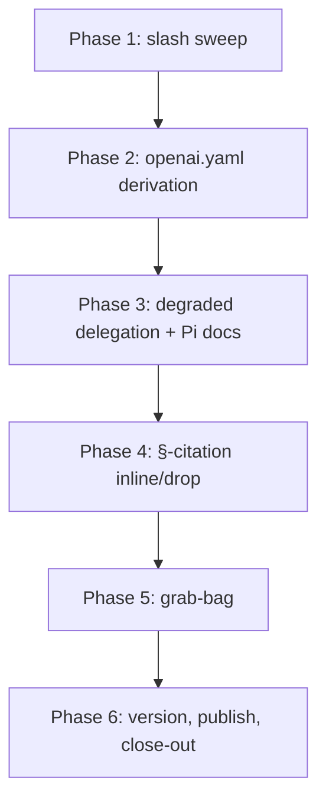

# Pre-publication polish pass: close the six harness-review issues (#2–#7)

| | |
|---|---|
| **Status** | done <!-- draft → approved → in-progress → done --> |
| **Created** | 2026-08-03 |
| **Modified** | 2026-08-04 |
| **Spec** | none — maintenance/polish on the toolbelt itself; no product behavior contract changes. Decisions settled via a grilling session (see Notes). |
| **Branch** | plan/pre-publication-polish |
| **Related plans** | [2026-08-03-harness-upgrades.md](2026-08-03-harness-upgrades.md) |
| **Review verdict** | APPROVE (blocker-scoped) — cycle 1 [reviews/2026-08-04-pre-publication-polish.md](../reviews/2026-08-04-pre-publication-polish.md) · cycle 2/2 [reviews/2026-08-04-pre-publication-polish-2.md](../reviews/2026-08-04-pre-publication-polish-2.md) |
| **Audit outcome** | [security-reviews/2026-08-04-pre-publication-polish.md](../security-reviews/2026-08-04-pre-publication-polish.md) — 1 MEDIUM found + fixed; 4 lenses clean |

## Summary

Close the six open issues (#2–#7, all from the 2026-07-16 pre-publication harness
review, all verified still-live against the current tree) with one polish pass: make
Codex interface strings truthful (generator-derived), stop leaking Claude `/slash`
syntax into canonical skill text, add a shared degraded-delegation reference for
skills that hard-require subagent fan-out, document the Pi explicit-invocation gap,
inline the dangling AGENTS.md §-citations, and fix the small grab-bag items (maturity
marker, janitor bounds + rendering, pre-commit entry, cmux selftest tmp paths,
justfile model vars, README structure list). Built in the private repo first, then
version-bumped and published via the existing snapshot flow.

## Problem

All six issues were verified live in the current tree (branch `fix/wayfinder-live-run-validation`):

- **#4** — 30 of 32 `skills/*/agents/openai.yaml` files carry boilerplate interface
  strings (`display_name: "Cmux"`, `short_description: "Use the Cmux workflow in this
  task."`, `default_prompt: "Use $cmux to help with this task."`); `bugfix` is a 31st
  near-boilerplate variant ("Use the Bugfix lightweight lane in this task."); only
  `new-app` is tailored. Codex users see an unfinished interface layer.
- **#5** — canonical skill text hardcodes Claude-style `/name` invocation (115 matches
  of `/code-audit|/execute|/review-plan|/ship` across skills/: 61 in SKILL.md, 48 in
  tests.md evidence prose, 6 elsewhere; `dogfood`'s own description says "Invoke as
  /dogfood <skill-name>"). Wrong on Codex (`$name`) and on Claude plugin installs
  (`/agentic-engineering:name`); models will print invocations that don't exist in
  their harness.
- **#2** — code-audit, security-audit, review-plan hard-require concurrent subagent
  fan-out with "Do not substitute a solo read-through"; codebase-design's
  DESIGN-IT-TWICE.md spawns 3+ subagents concurrently; research and
  improve-codebase-architecture each require delegation (a background agent / a
  read-only exploration subagent). No degraded path for Pi (one delegated task at a
  time) or Codex sessions lacking ad-hoc fan-out.
- **#3** — `skillPolicy.explicit` is enforced for Claude and Codex (lint-checked) but
  Pi's `package.json` block and `providers/pi/extensions/subagent.ts` carry no policy
  artifact; mutating skills are implicitly invocable on Pi. Same vulnerability class
  rated MEDIUM for Claude.
- **#6** — 49 lines (55 occurrences) of §I–§XIII citations in skills/templates
  resolve only against this toolbelt's AGENTS.md; the app AGENTS.md.template that
  `agentic init-app` installs has no numbered sections, so every citation dangles in
  the repos where the skills actually run.
- **#7** — 8 grab-bag items; 6 still live (maturity marker, janitor bounds +
  rendering, pre-commit entry, cmux /tmp selftest paths, justfile model vars, README
  structure list). dashboard.py IgnorePattern item: already fixed, no trace remains.
  Claude-render noise item: self-declared harmless, won't-fix.

## Solution

Six workstreams, ordered so text sweeps land before the generator derives from that
text, and every phase ends by regenerating the derived trees so the gate stays green:

- **Phase 1 — neutral invocation sweep (#5):** mechanical pass replacing `/name`
  invocation in canonical skill text (SKILL.md, references/, assets/, templates/) with
  neutral "invoke the `name` skill" wording. tests.md evidence prose (typed-command
  records, Last-verified lines) is out of scope by rule — rewriting it would falsify
  maturity evidence. The README's documented divergence table (`/spec` vs `$spec` vs
  `/skill:spec`) stays — that is deliberate documentation, not a leak. Ends with
  regeneration of `providers/` and `docs/skills.md`.
- **Phase 2 — generator-derived Codex interface strings (#4):** a derivation function
  (from canonical `description` first sentence + corrected display-name casing) plus a
  regen command and a lint equality check so the committed openai.yaml files can't rot
  back. Fixes the title-casing ("Tdd", "Cmux", "Babysitting Pr"). Explicitly overwrites
  new-app and bugfix too (see Decisions). Ends with regeneration of `providers/`.
- **Phase 3 — degraded-delegation reference (#2) + Pi documentation (#3):** one
  byte-identical `references/degraded-delegation.md` synced into the skills with
  delegation requirements (code-audit, security-audit, review-plan,
  codebase-design, research, improve-codebase-architecture), one-line links from each
  skill's delegation section, the capability table reused in a new "skill × provider
  support" table in docs/capabilities.md, plus the Pi explicit-invocation limitation.
- **Phase 4 — inline-and-drop § citations (#6):** replace each §-citation in skill
  text with the one-line principle it stands for (or drop it when already restated).
  App AGENTS.md.template stays lean — no renumbering. Ends with regeneration of
  `providers/` and `docs/skills.md`.
- **Phase 5 — grab-bag (#7):** 6 small fixes (maturity marker, janitor bounds +
  rendering, pre-commit entry, cmux mkdtemp, justfile vars, README structure list).
  Ends with regeneration of `docs/skills.md`.
- **Phase 6 — version, publish, close-out:** bump 0.2.0 → 0.2.1 across all four
  version manifests, CHANGELOG entry, tag `v0.2.1`, run the snapshot flow, PR closes
  #2–#7, status comment on #7 records the two triage outcomes.

## Success criteria

- [ ] `agentic gate` (`python3 scripts/ci/check_all.py`) green on the final branch,
      including `lint_plans.py` on this plan.
- [ ] `grep -rn '/code-audit\|/execute\|/review-plan\|/ship' skills/` restricted to
      SKILL.md/references/assets/templates returns 0 matches (tests.md evidence prose
      excluded by rule).
- [ ] Every `skills/*/agents/openai.yaml` interface block equals the output of the
      derivation function; lint fails on any divergence (proven by a selftest fixture
      that diverges and expects failure).
- [ ] All 6 delegation-requiring skills link the byte-identical
      degraded-delegation.md; lint_sediment enforces identity (selftest covers a
      diverged copy).
- [ ] docs/capabilities.md carries a "skill × provider support" table and states the
      Pi explicit-invocation limitation; no Pi policy artifact invented.
- [ ] 0 §-citations remain in canonical skills/ text (SKILL.md/references/assets/
      templates); app AGENTS.md.template unchanged.
- [ ] toolbelt.json `todo-cleanup` maturity is truthful with the matching literal
      marker (`live-verified`) in its tests.md.
- [ ] weekly_janitor_report.py reads DEVLOG.md/LESSONS.md with no-follow + size bound
      and does not render repo-controlled titles/labels as raw Markdown; spawn_fleet.py
      selftests use `tempfile.mkdtemp`; justfile model IDs are variables; README
      structure list includes docs/, plans/, security-reviews/, .github/, justfile,
      .pre-commit-config.yaml and links docs/skills.md.
- [ ] `providers/` and `docs/skills.md` are regenerated after every phase that makes
      them stale; `agentic gate` confirms no drift.
- [ ] Version 0.2.1 agreed across toolbelt.json, package.json,
      .claude-plugin/plugin.json, .codex-plugin/plugin.json, CHANGELOG entry present,
      `v0.2.1` tag on the exported ref, public snapshot published and re-verified.
- [ ] PR lands with #2–#7 closed; #7 comment records the two triage outcomes.

## Non-goals / out of scope

- No per-provider invocation-syntax injection into generated trees (grilled out — the
  model knows its own syntax; README documents divergence).
- No Pi explicit-invocation enforcement (grilled out — document-only; a mechanism
  exists only if @earendil-works/pi-ai exposes a skills-policy field, which we are not
  reverse-engineering in this pass).
- No renumbering of the app AGENTS.md.template to §I–§XIII.
- No per-skill hand-written openai.yaml strings (grilled out — generator-driven).
- Not re-opening the Claude-render noise item (won't-fix) or dashboard.py (already
  done).
- No rewriting of tests.md evidence prose that records literally-typed invocations —
  those are historical records, not instructions to the model.
- No changes to the Hermes-provider install flow or the upstream-sync registry.

## Threat model & hardening boundary

N/A — not a hardening/security change. The janitor bounds fix (Phase 5.2) is defensive
hygiene on an existing read path (symlink no-follow + size cap + escaping of
repo-controlled strings), not a new surface: the trust boundary stays "repo-controlled
files in the checked-out worktree, read by a scheduled Actions job under GitHub's
token scope".

## Assumptions & open questions

- **Assumption:** lint_sediment.py's identity check can be extended from
  `shared-pipeline.md` to a list including `degraded-delegation.md` without
  restructuring (verified by pre-approval review: `SHARED_BASENAME` constant,
  single-purpose — contained change).
- **Assumption:** `todo-cleanup` is truthful as `live-verified` — its tests.md documents
  a real 2026-07-02 migration run, matching prototype-spike's precedent. The exact
  value is the user's call at execution start (see Open question).
- **Open question:** `todo-cleanup` maturity value — `live-verified` (recommended,
  matches the documented run) vs `partially-live` (conservative). User decides in
  Phase 5.1.
- **Assumption:** publishing to 0.2.1 is the correct next version (current 0.2.0
  shipped 2026-07-31); the version-bump task is in the plan so the exact number is
  confirmable at execution.

## Research findings

N/A — fixed-stack/internal change; no ecosystem research needed. All claims in this
plan verified against the private repo tree this session (grep counts, file reads,
lint source inspection) and by an external pre-approval review (Claude Opus 5,
read-only, print mode) whose fact-check corrected two claim groups: the openai.yaml
count (32 files, bugfix variant) and the fan-out scope (3 skills + DESIGN-IT-TWICE
hard fan-out; research/ICA single delegation).

## Dependencies

none — stdlib-only changes (re, pathlib, tempfile, json). No new packages.

## Relevant files

**Existing (to change):**

| File | Why |
|---|---|
| `skills/*/SKILL.md`, `references/`, `assets/`, `templates/` (32 skill dirs) | Phase 1 slash sweep; Phase 4 § citations |
| `skills/{code-audit,security-audit,review-plan,codebase-design,research,improve-codebase-architecture}/SKILL.md` (+ `codebase-design/references/DESIGN-IT-TWICE.md`) | Phase 3 delegation links |
| `scripts/ci/lint_skills.py` | Phase 2 openai.yaml derivation + equality check + selftest fixture |
| `scripts/ci/lint_sediment.py` | Phase 3 identity check for degraded-delegation.md + selftest |
| `docs/capabilities.md` | Phase 3 new skill×provider table + Pi limitation |
| `toolbelt.json` | Phase 5.1 todo-cleanup maturity; Phase 6 version bump |
| `scripts/maintenance/weekly_janitor_report.py` | Phase 5.2 no-follow + size bounds + output escaping |
| `.pre-commit-config.yaml` | Phase 5.3 `language: system` python entry |
| `scripts/cmux/spawn_fleet.py`, `scripts/cmux/send_task.py` | Phase 5.4 mkdtemp |
| `justfile` | Phase 5.5 model vars |
| `README.md` | Phase 5.6 structure list |
| `package.json`, `.claude-plugin/plugin.json`, `.codex-plugin/plugin.json`, `CHANGELOG.md` | Phase 6 version bump + changelog |
| `plans/2026-08-03-pre-publication-polish.md` | this plan |

**New (to create):**

| File | Why |
|---|---|
| `skills/code-audit/references/degraded-delegation.md` (+ 5 synced copies) | Phase 3 shared reference |
| `reviews/2026-08-03-pre-publication-polish.md` | post-execution review-plan report (tracked evidence) |

**Generated (regenerated, never hand-edited):** `providers/claude/skills/**`,
`providers/codex/agents/*.toml`, `docs/skills.md`.

## Implementation phases

### Phase 1 — Neutral invocation sweep (#5)

- [x] 1.1 Create branch `plan/pre-publication-polish` off current HEAD.
- [x] 1.2 Sweep `skills/**/SKILL.md`, `references/`, `assets/`, `templates/`:
      replace "Invoke as /x" / "run /x" / "`/x`" with "invoke the `x` skill" (match
      the issue's own neutral convention). Do not touch README.md.
- [x] 1.3 Leave tests.md evidence prose untouched — typed-command records and
      Last-verified lines are historical evidence, not model instructions (rule, not
      judgment).
- [x] 1.4 Grep gate: `grep -rn '\/code-audit\|/execute\|/review-plan\|/ship' skills/`
      limited to SKILL.md/references/assets/templates → 0 matches.
- [x] 1.5 Regenerate derived trees: `python3 scripts/toolbelt.py generate` then
      `python3 scripts/ci/skill_catalog.py --generate`.
- [x] 1.6 Run `python3 scripts/ci/check_all.py`; fix fallout (e.g. dogfood's frontmatter
      description changes are fine — it is canonical text, not a linted contract).

**TDD:** none — mechanical text edit; the grep in 1.4 is the regression check.
**Validation:** 1.4 grep + `agentic gate` green (proves providers/ + docs/skills.md fresh).

### Phase 2 — Generator-derived Codex interface strings (#4)

- [x] 2.1 Add `derived_interface_strings(name: str, description: str) -> dict` to
      `scripts/ci/lint_skills.py` (or a sibling importable module): `display_name` from
      the skill dir name with a casing fix-up map (TDD, cmux, babysitting-pr →
      "TDD", "cmux", "Babysitting PR"), `short_description` from the canonical
      description's first sentence, `default_prompt` = the `Use $name to help with
      this task.` shape with the skill name substituted.
- [x] 2.2 Write failing selftest: add an in-memory fixture pair to `selftest()` whose
      interface block diverges from the derivation and must fail lint; run
      `python3 scripts/ci/lint_skills.py --selftest` and watch it fail (RED).
- [x] 2.3 Implement the lint check comparing each openai.yaml's interface block to the
      derivation; run selftest → PASS (GREEN).
- [x] 2.4 Add a regen path (flag `--fix` on lint_skills.py, or a small
      `scripts/ci/regen_openai.py`) that rewrites all 32 interface blocks from the
      derivation — including new-app and bugfix, which are overwritten by design
      (their interface text becomes derived; see Decisions).
- [x] 2.5 Run regen; review the full diff (new-app/bugfix included — their current
      hand-tailored text is replaced by derived text, so the diff is expected to touch
      them; new-app's missing `policy:` block stays missing because
      `new-app ∉ skillPolicy.explicit`, which lint_skills.py:159 tolerates).
- [x] 2.6 Regenerate providers/: `python3 scripts/toolbelt.py generate`.
- [x] 2.7 Run `agentic gate`.

**TDD:** strict
**Validation:** selftest RED→GREEN; `agentic gate` green; `git diff --stat` shows only
openai.yaml interface blocks + regenerated providers/.

### Phase 3 — Degraded-delegation reference (#2) + Pi documentation (#3)

- [x] 3.1 Write `skills/code-audit/references/degraded-delegation.md`: harness×delegation
      table (Claude markdown agents / Codex generated TOML / Pi subagent extension
      1-at-a-time / Hermes delegate_task), the sequential fresh-context fallback recipe
      (one lens pass per subagent, fresh context each), "no delegation at all → stop and
      run `agentic doctor`", and the hard rule "never substitute a solo read-through".
      Covers any delegation requirement — fan-out AND single-subagent — so it serves
      both the 3 fan-out skills and research/ICA's single-delegation case.
- [x] 3.2 Copy byte-identical into codebase-design, review-plan, research,
      security-audit, improve-codebase-architecture references/.
- [x] 3.3 Extend `scripts/ci/lint_sediment.py` `SHARED_BASENAME` handling to a list
      including `degraded-delegation.md`; extend its selftest with a diverged-copy case
      (RED first, then GREEN).
- [x] 3.4 Add the one-line link ("Can't delegate? See references/degraded-delegation.md
      — never substitute a solo read-through.") to each skill's delegation section
      (code-audit, security-audit, review-plan fan-out sections;
      codebase-design/DESIGN-IT-TWICE.md parallel-design section; research and
      improve-codebase-architecture single-delegation lines). **Stage the new
      references/ files (`git add`) before running the gate** — lint_skills.py resolves
      refs against tracked files and the pre-commit path reads the index.
- [x] 3.5 docs/capabilities.md: add a NEW "skill × provider support" table (the issue's
      requested shape; the existing capabilities table is per-OS, not per-provider, so
      this is a separate table) and a Pi explicit-invocation limitation note
      ("skillPolicy.explicit not enforced on Pi — mutating skills are implicitly
      invocable; see degraded-delegation.md").
- [x] 3.6 Regenerate providers/: `python3 scripts/toolbelt.py generate`.
- [x] 3.7 Run `agentic gate`.

**TDD:** strict
**Validation:** `diff` of the 6 copies empty; lint_sediment selftest green; gate green.

### Phase 4 — Inline-and-drop § citations (#6)

- [x] 4.1 Sweep the 49 lines (55 occurrences) of §I–§XIII citations across skills/
      (SKILL.md, references/, assets/, templates/): where the sentence restates the
      principle, drop the citation; where it doesn't, inline the one-line principle
      (e.g. "…or the bug just moves somewhere quieter" — no "(§VII)"). Leave this
      repo's AGENTS.md numbered sections untouched.
- [x] 4.2 Grep gate: `grep -rn '§' skills/` limited to SKILL.md/references/assets/
      templates → 0 matches.
- [x] 4.3 Regenerate derived trees: `python3 scripts/toolbelt.py generate` then
      `python3 scripts/ci/skill_catalog.py --generate` (12 descriptions currently
      embed `/slash` or `§` — e.g. execute's "Invoke as /execute", dogfood's
      "(§XII) … Invoke as /dogfood").
- [x] 4.4 Run `agentic gate`.

**TDD:** none — text edit; 4.2 grep is the regression check.
**Validation:** 4.2 grep + gate green (proves docs/skills.md re-derived).

### Phase 5 — Grab-bag (#7)

- [x] 5.1 toolbelt.json: `todo-cleanup` maturity → `live-verified` (user confirms value
      first; conservative alternative `partially-live`); add the literal
      `live-verified` marker to `skills/todo-cleanup/tests.md` (catalog check requires
      the exact string).
- [x] 5.2 `scripts/maintenance/weekly_janitor_report.py`: (a) open DEVLOG.md/LESSONS.md
      with `os.open(..., O_NOFOLLOW)` (or stat + lstat check) and a size cap (reuse
      `DEVLOG_ENTRY_LIMIT` pattern; add e.g. a 1 MiB read bound); (b) escape
      repo/GitHub-controlled titles/labels/subjects in the Actions summary output so
      they render as text, not raw Markdown/HTML. Selftest covers a symlink, an
      oversized file, and a hostile title string.
- [x] 5.3 `.pre-commit-config.yaml`: switch the entry to
      `language: system` + `entry: python3 scripts/ci/check_all.py` — cross-platform
      (works on native Windows where `scripts/ci/run_gate` cannot exec) and still
      avoids pre-commit's pip-install machinery (`language: script`'s original
      purpose). Keep the Windows `py -3` note in the comment.
- [x] 5.4 `scripts/cmux/spawn_fleet.py` (+ `send_task.py`): replace ALL fixed
      `/tmp/...` selftest paths (~20 sites in spawn_fleet.py incl. lines 715, 829,
      886, plus send_task.py:205) with `tempfile.mkdtemp()`; selftests still pass.
- [x] 5.5 `justfile`: hoist the hardcoded model IDs (`gpt-5.5`, `zai/glm-5.2`,
      `minimax/MiniMax-M3`) into top-of-file variables (next to the `python :=`
      line); update all 11 occurrences across the 3 recipes.
- [x] 5.6 `README.md` Repository structure list: add `docs/`, `plans/`,
      `security-reviews/`, `.github/`, `justfile`, `.pre-commit-config.yaml`; add the
      `docs/skills.md` (generated catalog) link.
- [x] 5.7 Regenerate docs/skills.md: `python3 scripts/ci/skill_catalog.py --generate`.
- [x] 5.8 Run `agentic gate`.

**TDD:** strict
**Validation:** gate green; each item's selftest covers its change.

### Phase 6 — Version, publish, close-out

- [x] 6.1 Confirm the target version with the user (recommended 0.2.1; current 0.2.0
      shipped 2026-07-31); bump in lockstep across `toolbelt.json`, `package.json`,
      `.claude-plugin/plugin.json`, `.codex-plugin/plugin.json`.
- [x] 6.2 Add the matching `CHANGELOG.md` entry for the version (changelog_has_release_
      heading is gate-checked — `scripts/toolbelt.py:286`).
- [!] 6.3 Export the private branch per `docs/publishing.md`; tag the exported ref
      `v0.2.1` (`publish_public.py` refuses to push without the tag); run the snapshot
      flow (`publish_public.py`) which force-pushes the public remote
      (~/github/agentic-engineering is the local checkout of that remote, not the
      push target).
- [!] 6.4 Open PR (private) with body "Closes #2, Closes #3, Closes #4, Closes #5,
      Closes #6, Closes #7"; comment on #7 recording — dashboard.py item resolved
      (verified gone), Claude-render item won't-fix (self-declared harmless), remaining
      6 fixed by this PR.
- [!] 6.5 After merge + publish: verify the public tree carries the same fixes
      (`git -C ~/github/agentic-engineering log -1` + spot greps for the sweep
      criteria).

**TDD:** none — release mechanics; verification is the published-tree check in 6.5.
**Validation:** gate green on the tagged ref; `v0.2.1` tag present; public remote
carries the fixes.

## Test / validation strategy

- Behavioral changes are selftest-verified RED→GREEN: lint_skills derivation check
  (2.2/2.3), lint_sediment identity check (3.3), janitor bounds + escaping (5.2), cmux
  mkdtemp (5.4).
- Text sweeps are grep-gated: `/slash` (1.4), `§` (4.2) — restricted to canonical
  text; the exact greps that proved the issues live are the regressions that prove
  them dead.
- Regeneration is gate-enforced: every phase that touches canonical text or manifests
  ends with `toolbelt.py generate` and/or `skill_catalog.py --generate`, and
  `agentic gate` (which includes `validate_source(check_generated=True)` and the
  catalog staleness check) proves the derived trees are fresh.
- The plan document itself must pass `lint_plans.py` (TDD markers bare `strict` /
  `none — <reason>`, no unfilled template tokens) — it failed pre-approval and was
  corrected.
- Every phase ends with `python3 scripts/ci/check_all.py`; the PR rides the standard
  review-plan → code-audit → security-audit (risk-gated) → ship chain, with @codex
  review rounds per repo convention.

## Risks & rollback

- **openai.yaml regen churn:** derivation overwrites new-app and bugfix's
  hand-tailored text. Mitigation: first-sentence truncation with a cap, full-diff
  review in 2.5, and the lint check guarantees the new text is at least consistent.
  Rollback: revert Phase 2 commit; files are committed, no state loss.
- **Slash sweep collateral:** 32 dirs touched — risk of stray edits. Mitigation:
  surgical-change rule (§IV), restricted grep gate, review-plan. Rollback: revert
  per-commit.
- **lint_sediment extension:** touching a gate component could false-fail other skills.
  Mitigation: selftest covers diverged AND identical cases; gate run after 3.3.
- **Publishing path:** version bump + tag is a release action — a mistake publishes
  the wrong ref. Mitigation: 6.1 confirms version with user; tag created on the
  exported ref exactly as publishing.md specifies; rollback of a bad public snapshot
  is a re-export (the public repo is a curated snapshot by design).
- Low overall risk — no schema, no behavior-contract, no dependency changes.

## Decisions & tradeoffs

- **Generator-derived openai.yaml strings** — chosen over hand-writing 30 files
  because one derivation + lint check cannot rot (Q2); tradeoff: display-name casing
  needs a small fix-up map, and new-app/bugfix's hand-tailored text is overwritten
  (reviewed in 2.5; the lint check keeps the derived output truthful).
- **Neutral sweep only, no per-provider injection** — chosen because rendered bodies
  are read by models that know their own invocation syntax, and README already
  documents divergence (Q3); tradeoff: canonical text is slightly less specific.
- **tests.md evidence prose out of scope** — chosen because 48 of the 115 slash hits
  are literal records of what was typed in live runs, and rewriting them falsifies the
  maturity evidence skill_catalog depends on (pre-approval finding #8); tradeoff: the
  grep gate must be scoped to canonical text rather than all of skills/.
- **Shared degraded-delegation.md over per-skill paragraphs** — chosen because the repo
  already enforces byte-identical shared refs (shared-pipeline.md) and it avoids 6x
  maintenance (Q4); tradeoff: a stranger reading one skill cold must open the reference.
  Scoped to "any delegation requirement" after the fact-check showed only 3 skills +
  DESIGN-IT-TWICE hard-require fan-out while research/ICA need single delegation.
- **Pi document-only, no enforcement** — chosen because enforcement is theater without
  a real Pi mechanism and the issue itself accepts documentation (Q5); tradeoff: the
  MEDIUM-rated vulnerability class stays open on Pi, now honestly disclosed.
- **Inline-and-drop § citations over template renumbering** — chosen because the app
  template should stay lean and the principles are already restated (Q6); tradeoff:
  skills lose the pointer to the numbered rulebook in repos that have one.
- **Grab-bag: close 2 of 8, fix 6** — dashboard.py already fixed; Claude-render noise
  self-declared harmless (Q7). Pre-commit entry becomes `language: system` + python3
  (fixes Windows natively, keeps non-package behavior) rather than "already
  documented".
- **Publishing included in-scope (0.2.1)** — the snapshot flow is not executable
  without a version bump + tag, so the plan tasks it explicitly (pre-approval finding
  #4) instead of leaving 6.3 as an un-runnable instruction.

## Definition of Done

- [ ] All success criteria met
- [ ] Tests pass (behavioral changes covered RED→GREEN)
- [ ] Diff is surgical — every changed line justified by this plan
- [ ] `agentic gate` green, including `lint_plans.py` on this plan
- [ ] `providers/` and `docs/skills.md` regenerated and drift-free
- [ ] v0.2.1 shipped; #2–#7 closed with PR keywords; #7 triage comment posted
- [ ] Public snapshot published and re-verified

## References

- GitHub issues #2–#7, crashcartlabs/agentic-engineering-private (2026-07-16
  pre-publication harness review)
- `skills/plan/assets/plan-template.md` (this document's shape)
- `plans/2026-08-03-harness-upgrades.md` (prior plan conventions)
- `docs/publishing.md` (snapshot/version/tag mechanics for Phase 6)
- Pre-approval review by Claude Opus 5 (read-only, print mode) — 5 must-fix, 7
  should-fix, 5 nits; all incorporated; full transcript not retained.

## Notes

Decisions settled in a grilling session this day (one question at a time, all seven
answered with the user's confirmation): public product for Claude/Codex/Pi/Hermes;
openai.yaml generator-driven; slash sweep neutral-only; shared degraded-delegation
doc; Pi document-only; §-citations inline-and-drop; grab-bag closes items 5+8, fixes 6.

The plan was REVISEd after a pre-approval review (Claude Opus 5) found: TDD markers
that failed lint_plans.py, missing providers/ + docs/skills.md regeneration tasks
(staleness is a gate failure), an un-executable publish step (needs version bump +
tag), a mis-scoped Phase 3 (fan-out vs single-delegation), and a success criterion
conflicting with its own carve-out. All findings incorporated; the two wrong factual
claims (31→32 openai.yaml files, 5→3 hard fan-out skills) were corrected in Problem
and Phase 3.

## Execution Notes

_Phase-by-phase record of the execution run; factual, not a verdict._

- **Phase 1 (slash sweep):** canonical skill text neutralized to "invoke the `name`
  skill" wording; tests.md evidence prose untouched by rule; providers/ +
  docs/skills.md regenerated; grep gate clean.
- **Phase 2 (openai.yaml derivation):** `derived_interface_strings()` + equality
  lint in lint_skills.py with RED→GREEN selftest fixture and a regen path; all 32
  interface blocks derived (new-app/bugfix overwritten by design); providers/
  regenerated.
- **Phase 3 (degraded delegation + Pi docs):** byte-identical
  `references/degraded-delegation.md` synced into the 6 delegation-requiring
  skills; lint_sediment SHARED list extended with a diverged-copy selftest;
  docs/capabilities.md skill × provider table + Pi explicit-invocation note;
  providers/ regenerated.
- **Phase 4 (§ citations):** 49 lines of §I–§XIII citations inlined or dropped;
  grep gate clean; providers/ + docs/skills.md regenerated.
- **Phase 5 (grab-bag):** todo-cleanup maturity → `live-verified` (5.1, value
  settled by the launcher); janitor no-follow + 1 MiB bound + output escaping with
  selftest (5.2); pre-commit `language: system` (5.3); cmux selftests switched to
  `tempfile.mkdtemp()` roots (5.4); justfile model vars (5.5); README structure
  list (5.6); docs/skills.md regenerated (5.7); gate green (5.8). Two count notes:
  the justfile actually carried 12 model-ID occurrences, not the plan's 11 — all 12
  were hoisted; 5.4 replaced the 12 real filesystem-mutating `/tmp` roots and left
  the 9 inert assertion-comparison string references untouched, per the launcher's
  instruction (the plan's "~20 sites" was an over-estimate).
- **Phase 6 (partial):** 0.2.1 bumped in lockstep across toolbelt.json,
  package.json, .claude-plugin/plugin.json, .codex-plugin/plugin.json (6.1 — the
  version was settled by the launcher, no user stop needed); CHANGELOG 0.2.1 entry
  added (6.2); gate green on the branch. Tasks 6.3–6.5 (export/tag/publish, PR +
  #7 comment, public-tree verification) are marked [!] — out of scope for the
  executor, which never pushes, opens PRs, or publishes; the human launcher
  completes them after review (see Amendments).
- **Noticed, not done (pre-existing, out of plan scope):**
  `scripts/eval/run_eval.py --selftest` has a TOCTOU flake — `child_survived()`
  catches `FileNotFoundError` but not `ProcessLookupError` from `/proc/<pid>/stat`;
  it flaked once mid-gate (exit 2, treated as a crash) and passed on rerun. Not
  touched; a related FileNotFoundError fix for the same function landed in the
  harness-upgrades plan.
- **Review-driven fix pass (code-audit, post-approval):** findings A–I from
  `code-reviews/2026-08-04-pre-publication-polish.md` fixed and committed on this
  branch, full gate green at every commit (ed73615, ad8363f, 791748c, 96d112a,
  e48cbd8, f0db687, ca498ec). The finding-H fix direction also named
  `cmux/SKILL.md:21`'s imperative fleet line; that item was verified already
  clean (`cmux deploy N workspaces …`; line 33's `/Applications/cmux.app` is a
  benign path, no `⟪` anywhere in skills/) — no edit needed (see Amendments).

Reviewer should look closely at: the Phase 2 derivation diff on new-app/bugfix;
byte-identity of the six degraded-delegation copies (Phase 3); the janitor escaping
selftest fixtures (Phase 5.2); the mkdtemp refactor's preserved cleanup semantics
(Phase 5.4 — `preflight_repo`'s root is left as an empty temp dir, matching the
prior fixed-path behavior).

## Amendments

- 2026-08-04 — Tasks 6.3–6.5 (export the private branch + tag `v0.2.1` +
  `publish_public.py` snapshot flow; open the private PR with the "Closes #2–#7"
  body and the #7 triage comment; verify the public tree post-merge) are marked
  [!]: the executor never pushes, opens PRs, or publishes — those are the human
  launcher's steps, completed after review. Version bump + changelog (6.1/6.2) are
  complete and gate-green on this branch, so the branch is publish-ready.
- 2026-08-04 — Review-driven fix pass (code-audit, report
  `code-reviews/2026-08-04-pre-publication-polish.md`), findings A–I, all fixed
  and committed on this branch with the full gate green at each commit: **A** —
  `--fix` interface-block parse/rewrite now consumes the whole block instead of
  a prefix, so blocks are no longer corrupted (ed73615); **B** — janitor
  `read_repo_record` refuses dirs/FIFOs and wraps read/decode failures, emitting
  a Finding instead of crashing (96d112a); **C** — the same refuse-dirs/FIFOs
  guard closes the FIFO-at-path hang (96d112a); **D** — spawn_fleet selftest no
  longer leaks one temp dir per run (e48cbd8); **E** — `exclude_wt` dropped its
  fixed shared /tmp path for per-run isolation, so a stale dir cannot crash the
  gate and concurrent runs cannot collide (e48cbd8); **F** — display-name
  acronym casing is enforced beyond the 3-entry fixup list (791748c); **G** —
  `--fix` no longer aborts mid-regen on an unreadable openai.yaml, leaving no
  partial tree (ad8363f); **H** — slash sweep completed on the 12 skill H1 title
  lines and the invocation gate widened from the four issue-named skills to a
  blanket `/name` matcher (`SLASH_HEADING_RE`/`SLASH_INVOCATION_RE` wired into
  `main()`), with selftest fixtures for clean/dirty text and real-path negatives
  (/dev/null, /tmp, /usr/local/bin) (f0db687); **I** — README structure list
  corrected to the actual tree: `.github/ — CI workflows` (no issue templates
  exist), `security-reviews/` dropped (dir absent), `reviews/` added for the
  plan-conformance review reports (ca498ec). Deviation: finding H's fix
  direction also named `cmux/SKILL.md:21`'s imperative fleet line, but that line
  was verified already clean — it reads `cmux deploy N workspaces …`, line 33's
  `/Applications/cmux.app` is a benign path, and no `⟪` occurs anywhere in
  skills/ — so no edit was needed.
- 2026-08-04 — Cycle-2 code-audit (report
  `code-reviews/2026-08-04-pre-publication-polish-2.md`) found 9 issues in the
  first fix pass; all fixed and committed in `a4c3632` with the full gate green
  and adversarial reproductions: **(1, BUG)** `fix_openai_interfaces` now
  catches `(OSError, UnicodeDecodeError)` per file — a 0xFF-byte openai.yaml
  can no longer abort the regen mid-loop; **(2)** `--fix` exits with the regen
  status instead of re-entering the lint phase (no re-crash on unreadable
  files), and the slash sweep skips binary/unreadable canonical files so a PNG
  under assets/ cannot crash the gate; **(3–5)** the invocation gate is now
  case-insensitive, catches backtick-wrapped / "invoke the /name" /
  sentence-final-period forms, is fence- and code-span-aware (CLI examples in
  fenced blocks or inline spans are code, not instruction), and the heading
  regex carries the path-continuation lookahead so `# /dev/null — …` headings
  are not flagged; **(6)** janitor `read_repo_record` opens with `O_NONBLOCK`
  and re-verifies `S_ISREG` via fstat, closing the lstat→open FIFO TOCTOU;
  **(7)** the finding-G selftest no longer uses chmod(0o000) at euid 0 (DAC
  bypass) — a decode-error fixture exercises the same reporting path there;
  **(8)** the divergence check is syntactic (`rewrite == text`), so lint-clean
  means `--fix` fixed-point (key reorder / unquoted / duplicated keys are
  flagged and repairable); **(9)** `--fix` inserts the derived interface block
  when the head is missing instead of dead-ending. Also: the janitor selftest's
  FIFO and unreadable-parent fixtures are platform-guarded (no `os.mkfifo` on
  Windows, no DAC semantics) so the gate stays green on windows-latest.
- 2026-08-04 — Cycle-3 verification (fix-closure 9/9 + edge lens + adversarial
  re-trigger) found 1 BUG + 2 RISKs in the round-2 code plus two partial
  closures; all fixed in `b0dbe7b`, gate green: **(span BUG)** the slash
  sweep's code-span detection is now CommonMark-balanced (a run of N backticks
  closes with N backticks) — even-length `` ``x`` `` spans are no longer false
  positives, an unmatched backtick no longer suppresses real prose after it,
  and every match on a line is examined so a suppressed code example cannot
  hide a later real invocation; **(binary files)** a new
  `gittracked.tracked_text_or_none()` makes lint_skills/lint_links/lint_records/
  lint_plans report unreadable or undecodable files as findings instead of
  crashing the gate (lint_sediment keeps raw `tracked_text` for its latin-1
  byte-scan fallback); **(comment-headed insert)** `--fix` inserts the derived
  block after leading blank lines/comments so a comment-headed headless
  openai.yaml converges in one run and is a fixed point (the comment is
  preserved); **(preview FIFO)** `janitor_preview.build_preview` reads
  LESSONS.md through the same O_NONBLOCK + fstat guard as the janitor — a FIFO
  at LESSONS.md can no longer hang the weekly run (e2e verified). Round-2
  findings 1-9 stay closed.
- 2026-08-04 — Security audit (report
  `security-reviews/2026-08-04-pre-publication-polish.md`): trust-boundary map
  over the whole diff; 5 attack-class hunters. One MEDIUM confirmed — the
  janitor's clutter-path field rendered a hostile filename (backtick + newline
  + markdown payload in a `.pyc` name) through a plain backtick span into the
  `$GITHUB_STEP_SUMMARY` — **fixed in `40e080b`** (newline-squash + adaptive
  `md_code_span` on path/detail, hostile-filename selftest fixture, gate
  green). AuthN/AuthZ, secrets/crypto, untrusted-input (incl. ReDoS probes),
  and config/deps lenses: no findings. Hardening notes recorded (unbounded
  lint reads, local-preview raw rendering, echoed-name log prefix vector).
  Also from cycle-3 adversarial re-trigger: `skill_catalog` crashed the gate
  on a binary SKILL.md/tests.md — **fixed in `fb8b29f`** (guarded reads
  degrade to findings). `security-reviews/` now exists as tracked evidence, so
  the README structure list bullet is restored.
- 2026-08-04 — @codex PR review (PR #17): 7 notes (2 P1, 5 P2). Fixed 4
  (59c87b5): selftest no longer depends on PyYAML (note 1); janitor chmod
  assertion skipped at euid 0 (note 2); pre-commit entry back to the
  cross-platform `run_gate` wrapper (note 4); janitor_preview LESSONS.md read
  bounded at 1 MiB + oversize flag (note 6); duplicate top-level `interface:`
  block flagged (note 7). Pushed back on 2 (documented in the PR reply): note 3
  (Codex 25-64 limit is not a regression — SHORT_DESC_CAP=140 is this
  toolbelt's contract, in-repo files predate the PR); note 5 (degraded-
  delegation.md Codex row is a pre-existing doc-accuracy nit, byte-identical
  across 6 skills).
- 2026-08-04 (round 2) — @codex PR review (PR #17), 8 more notes (1 P1, 7 P2).
  Fixed 6 (commit to follow):
  - Note 8 (P1): `fix_openai_interfaces` now rejects symlinked skill dirs and
    `agents/openai.yaml` (lstat no-follow) — was arbitrary-file-write through a
    symlink target outside the worktree.
  - Note 4 (P2): `--fix` skips a skill whose SKILL.md frontmatter is missing or
    has no nonempty description, instead of silently rewriting a valid
    openai.yaml to `short_description: ""`.
  - Note 10 (P2): headless openai.yaml that is a comment without a trailing
    newline now gets a separating newline before the inserted interface block
    (was gluing `# generatedinterface:` and breaking the fixed point).
  - Note 7 (P2): slash sweep excludes bare absolute-directory roots
    (`/tmp`, `/bin`, …) so "use /tmp for temporary files" is no longer a false
    invocation; real paths (`/tmp/setup.sh`) still excluded by continuation.
  - Note 6 (P2): janitor clutter render neutralizes control chars (incl.
    newlines) but PRESERVES ordinary filename whitespace, so "cache  old.pyc"
    stays distinct from "cache old.pyc".
  - Note 3 (P2): pre-commit hook `language` corrected to `script` (was
    `system`) so Windows resolves `scripts/ci/run_gate.cmd` instead of exec'ing
    the POSIX sh wrapper directly.
  Pushback (2, documented in PR reply):
  - Note 1 (P2): the private-repo identifier does NOT leak — `publish_public.py`
    already gates the snapshot on a bare-private-handle check and the shipped
    public tree is clean (verified: no `crashcartlabs`/`agentic-engineering-
    private` outside `.git`). A dry-run on this commit would have FAILED that
    check, not retained the id.
  - Note 9 (P2): fence-length claim is wrong — `_code_span_positions` already
    tracks the opening run length and closes only on a compatible run; a
    4-backtick fence with an internal triple is handled correctly (CommonMark).
- 2026-08-04 (round 3) — @codex PR review (PR #17), 2 more notes (1 P1, 1 P2).
  Both confirmed real and fixed (39c8886 -> next commit):
  - Note 8b (P1): `fix_openai_interfaces` now also rejects a symlinked `agents/`
    directory (not just the final `openai.yaml`), and requires the resolved
    openai.yaml to stay inside the skill dir — closes the `agents -> /tmp/x`
    arbitrary-file-write variant.
  - Note 6b (P2): `_sanitize_report_text` no longer collapses tabs (`\x09`) to
    spaces — tabs are ordinary filename whitespace and are preserved, so a
    `cache<TAB>old.pyc` candidate stays distinct.
- 2026-08-04 (round 4) — @codex PR review (PR #17), 1 note (P2).
  Confirmed real and fixed (ab5ad6e -> next commit):
  - Note (P2): the HTML loop in `lint_links.py` called `tracked_text(page)`
    (raises UnicodeDecodeError on invalid UTF-8, e.g. a 0xff byte in
    docs/cmux-guide.html) — only the Markdown path had been migrated to the
    safe `tracked_text_or_none()`. Migrated the HTML loop too; an unreadable /
    invalid-UTF-8 HTML file is now reported as a lint finding instead of
    aborting the gate. Regression selftest added (invalid-UTF-8 HTML repro).
