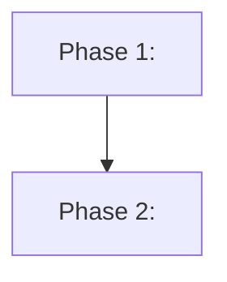

<!--
PLAN TEMPLATE — fill every section. Rules:
- Keep the section order below exactly; reviewers (human and agent) rely on it being predictable.
- Replace every <placeholder>. Leave no placeholder behind (self-review checks this).
- CONDITIONAL sections are marked. If one doesn't apply, collapse it to a single line:
  "N/A — <one-line reason>". Do not delete it; the shape stays constant for every plan.
- Prefer checklists and tables over prose. Front-load the contract; detail comes after.
- Checkbox legend for tasks:  - [ ] todo   - [x] done   - [~] wip   - [!] blocked
-->

# <Plan title>

| | |
|---|---|
| **Status** | draft <!-- draft → approved → in-progress → done --> |
| **Created** | <YYYY-MM-DD> |
| **Modified** | <YYYY-MM-DD> |
| **Spec** | <path to specs/... or "none — reason"> |
| **Branch** | <branch or "tbd"> |
| **Related plans** | <links, or "none"> |
| **Review verdict** | not run |
| **Audit outcome** | not run |

## Summary

<!-- One short paragraph: the confirmed teach-back understanding, distilled. What this does and why, readable in 10 seconds. -->

## Problem

<!-- What's wrong / missing today, and why it matters. Concrete, not abstract. -->

## Solution

<!-- The chosen approach in prose. Add a Mermaid diagram ONLY if it adds context (architecture flowchart, sequence, etc.). -->

## Success criteria

<!-- Testable assertions — how we KNOW it's done. Each must be checkable, not a vibe. -->

- [ ] <e.g. "A POST with a missing email returns 400 with a clear message">
- [ ] <...>

## Non-goals / out of scope

<!-- What we are deliberately NOT doing. This is the anti-scope-creep contract. -->

- <...>

## Threat model & hardening boundary

<!-- REQUIRED for hardening/security plans. For each defended surface, model the
access and ordering before choosing mitigations. If not a hardening/security plan:
"N/A — not a hardening/security change." -->

| Defended surface | Open/write calls | Check-use orderings | Trust boundary |
|---|---|---|---|
| <path/API/resource> | <every open/write/delete/rename/exec call that can affect it> | <each check-before-use, TOCTOU window, or "none"> | <who can write/read/replace inputs, paths, configs, pidfiles, temp files> |

- **Rule:** state the trust boundary; stop hardening past it unless a new documented trust boundary expands the scope.

## Assumptions & open questions

<!-- The deferred "5%": things assumed rather than confirmed, and minor unknowns that won't change what gets built. Name them so executor/reviewer know what was assumed vs decided. -->

- **Assumption:** <...>
- **Open question:** <...> <!-- or "none" -->

## Research findings

<!-- CONDITIONAL. If Phase 1 used external/web/ecosystem research, keep only findings
that shape the plan. Tag each factual claim inline:
- [VERIFIED: source] = verified this session against an authoritative source and, where
  relevant, real tooling/source inspection.
- [CITED: url] = cited from official documentation.
- [ASSUMED] = unverified training/search/registry-only/repo-inference claim.
Registry existence alone is [ASSUMED] for package legitimacy. Any approach-changing
[ASSUMED] claim belongs in Assumptions & open questions and blocks Gate 1 until resolved.
If no external research was needed: "N/A — fixed-stack/internal change; no ecosystem
research needed." -->

| Finding | Provenance | Source | Plan impact |
|---|---|---|---|
| <claim/finding> | <[VERIFIED: source] / [CITED: url] / [ASSUMED]> | <url/path/tool output> | <decision/constraint> |

## Dependencies

<!-- "none", or each new dependency as "X — because Y". Cite the Research
findings row that supports any new external dependency. Registry existence alone does
not prove package legitimacy. Nothing reaches the executor unjustified. -->

none

## Relevant files

**Existing (to change):**

| File | Why |
|---|---|
| `<path>` | <reason> |

**New (to create):**

| File | Why |
|---|---|
| `<path>` | <reason> |

<!-- If any phase generates artifacts that must stay out of git (reports, build outputs,
scratch files), the `.gitignore` rule is a planned change — list it here and task it in a
phase. The executor never edits ignore rules on its own; an unplanned artifact goes to
Execution Notes as "noticed, not done". -->

## Implementation phases

<!-- Include this Mermaid phase-dependency graph when execution order matters. It is BOTH a human visual and a machine-readable ordering for the executor. Remove only if there is genuinely a single linear phase. -->

### Phase 1 — <name>

- [ ] 1.1 <task>
- [ ] 1.2 <task>

**TDD:** <`strict` for a behavioral phase built red-green through the `tdd` skill, or `none — <reason>`.>
**Validation:** <how this phase proves itself — commands to run, behavior to observe.>

### Phase 2 — <name>

- [ ] 2.1 <task>

**TDD:** <...>
**Validation:** <...>

## Test / validation strategy

<!-- Overall testing approach. Behavioral changes MUST name the test that would fail without the change. -->

- <...>

## Risks & rollback

<!-- CONDITIONAL. For hard-to-reverse changes: what could go wrong and how to back out. Otherwise: "N/A — <reason>". -->

N/A — <reason>

## Decisions & tradeoffs

<!-- What we chose and WHY, so the reviewer can check the implementation against intent.
If the human chose their approach over one the planner recommended, record BOTH options
and the reason, so the reasoning survives. For researched gray-area decisions, use:
| Option | Pros | Cons | Complexity | Recommendation |
where Complexity is impact surface plus risk, never a time estimate, and Recommendation
is conditional ("recommend if X"), not a single-winner ranking. Promote to a standalone
ADR only if a decision is hard to reverse AND surprising later AND the result of real
tradeoffs. -->

- **<Decision>** — chosen because <...>; considered <...>; tradeoff is <...>.

## Definition of Done

<!-- When are we allowed to call this complete? This + Success criteria ARE the reviewer's checklist. -->

- [ ] All success criteria met
- [ ] Tests pass (behavioral changes covered)
- [ ] Diff is surgical — every changed line justified by this plan
- [ ] <...>

## References

<!-- CONDITIONAL. Docs, tickets, prior art read during planning. Otherwise "none". -->

none

## Notes

<!-- CONDITIONAL. Freeform context that doesn't fit above. Otherwise "none". -->

none

## Execution Notes

<!-- Owned by the EXECUTOR — the planner leaves this exactly as-is. During execution it
collects "noticed, not done" items (out-of-scope observations, including generated
artifacts the plan didn't anticipate); at finish the executor writes short factual notes:
what got built, deviations (with the matching Amendment), what the reviewer should look
at closely. Facts, not grades. -->

_Not started._

## Amendments

<!-- Append-only. Starts empty; populated after execution begins. Each entry: date — what changed and why. -->

_None yet._
